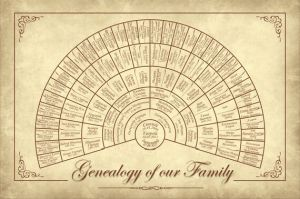

# Create 3D fanchart with timeline from a GEDCOM genealogy file.
## Usage
```
python fanchart3d.py
```
Then open index.html in a browser.<br>
Use plus and minus keys to change visibility of generations.<br>
Edit fanchart3d.py to select your own GEDCOM file
## Features
Fanchart3D combines a genealogy timeline with a fanchart into a 3D object in the browser<br>
[](img/PriestleyChart.gif) 
[](img/fanchart.jpg) <br>
Python script fanchart3d.py creates a json input file (generated/data.js).<br> 
Javascript file fanchart3d.js creates a 3D representation in the browser using Three.js.
## Example
A 3D fanchart of the Dutch Royal Family
[](img/dutchroyalfamily.gif) 
## Special Thanks
- [gedcom.py](https://github.com/nickreynke/python-gedcom) by Nick Reynke to parse the gedcom file
- [famousfamilytrees](http://famousfamilytrees.blogspot.com/?m=1) for the demo gedcom files
## To do
- [x] add animated gif
- [ ] nicer animated gif
- [ ] +/- for resize
- [ ] explain how dates are guessed
- [ ] put text on top of the fanchart
- [ ] put text on top of the timeline
- [ ] add timeline with year numbers
